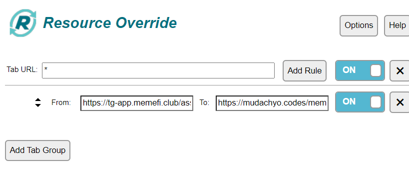
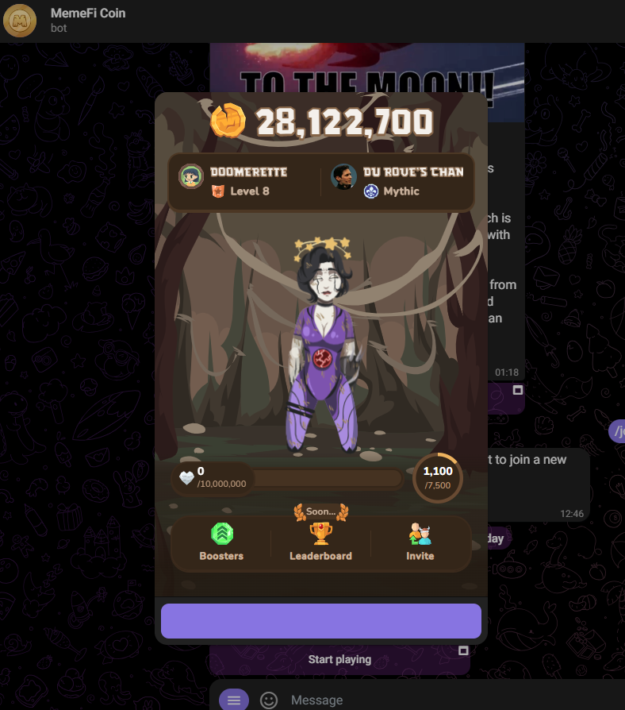

> [!NOTE]
> - Contacts: [Telegram](https://t.me/mudachyo)
> - Channel: [Telegram Channel](https://t.me/shopalenka) 
> - 🇷🇺 README на русском доступен [здесь](README.md)
---
## How to run  
- Install extension in your browser [Violentmonkey](https://chromewebstore.google.com/detail/violentmonkey/jinjaccalgkegednnccohejagnlnfdag?hl=be)
- In order for **MemeFi** to open in a browser, install [this script](https://github.com/mudachyo/MemeFi-Coin/raw/main/memefi-web.user.js)
- To install **autoclicker** install [this script](https://github.com/mudachyo/MemeFi-Coin/raw/main/memefi-autoclicker.user.js)
- Open [Bot MemeFi](https://web.telegram.org/k/#?tgaddr=tg%3A%2F%2Fresolve%3Fdomain%3Dmemefi_coin_bot%26start%3Dr_6ef9514b38) and run the game
## Corrects Connection Failed error
- Install the [Resource Override](https://chromewebstore.google.com/detail/resource-override/pkoacgokdfckfpndoffpifphamojphii) extension in your browser.
- Open the extension settings and enter the following information:
- **Tab URL:** `*`
- **From:** `https://tg-app.memefi.club/assets/index-*`
- **To:** `https://mudachyo.codes/memefi/index-B8luuorR.js`
- Open [Bot MemeFi](https://web.telegram.org/k/#?tgaddr=tg%3A%2F%2Fresolve%3Fdomain%3Dmemefi_coin_bot%26start%3Dr_6ef9514b38) and run the game

---
- 

---
> [!TIP]
> Other repositories:
> 
> - [Hamster Kombat + Autoclicker](https://github.com/mudachyo/Hamster-Kombat)
> 
> - [TapSwap + Autoclicker](https://github.com/mudachyo/TapSwap)
> 
> - [Blum + Autoclicker](https://github.com/mudachyo/Blum)
>
> - [PixelTap + Autoclicker](https://github.com/mudachyo/PixelTap)
> 
> - [MemeFi + Autoclicker](https://github.com/mudachyo/MemeFi-Coin)
>
> - [Yescoin + Autoclicker](https://github.com/mudachyo/Yescoin)
>
> - [Gemz + Autoclicker](https://github.com/mudachyo/Gemz)
>
> - [Сrossfi + Autoclicker](https://github.com/mudachyo/Crossfi)
>
> - [BUMP + Autoclicker](https://github.com/mudachyo/BUMP)
>
> - [W-Coin + Autoclicker](https://github.com/mudachyo/W-Coin)
>
> - [1win + Autoclicker](https://github.com/mudachyo/1win-Token)
>
> - [Not Pixel + Autoclicker](https://github.com/mudachyo/Not-Pixel)
>
> - [X-Empire + Autoclicker](https://github.com/mudachyo/X-Empire)
>
> - [Tomarket](https://github.com/mudachyo/Tomarket)
>
> - [xKuCoin + Autoclicker](https://github.com/mudachyo/xKuCoin)
---
> [!IMPORTANT] 
> Donation
> 
> - [Donate](https://mudachyo.codes/donate/)
> 
> Donations will be used to maintain the project.